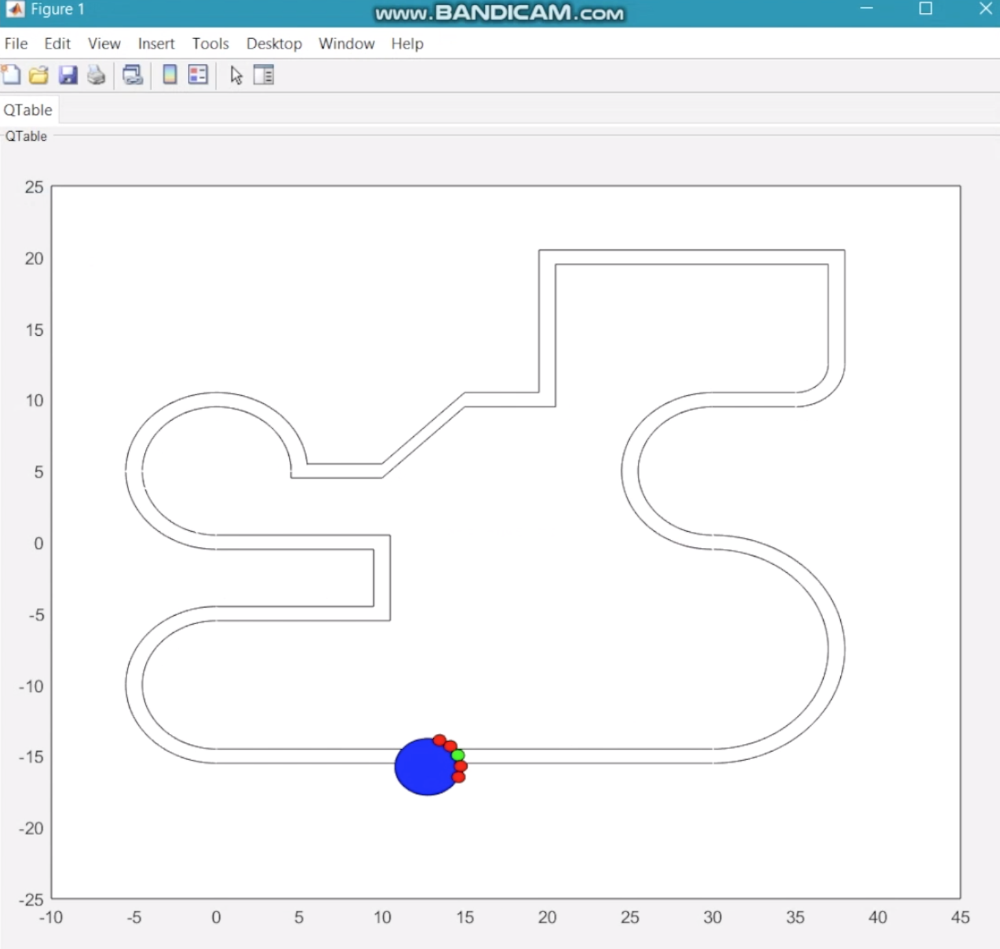
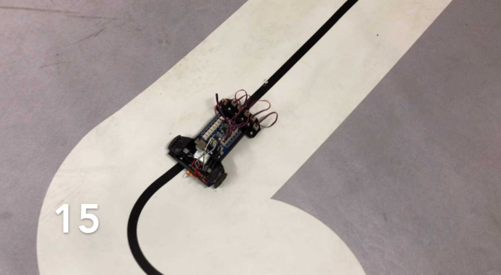

# Reinforcement Learning for Line Follower mobile robot

This project is an application of the Reinforcement Learning method in simulations and control of the Line Follower mobile robot. It was my bachelor thesis.

## Getting started
 
This project consists of two phases. First is the Matlab program for simulation of line follower robot, which is controlled by the reinforcement learning method. At this stage, it is examined, what parameters most influence the performance of the agent. 

The second part of the project is an implementation of the algorithm for the real line follower robot.

### Reinforcement Learning method for this problem

In this method, the system learns to behave in the changing environment by making a lot of actions. It is rewarded by the good ones and punished if such action led to bad performance results. As the number of trials increases, the robot learns to maximize the reward and consequently it is able to follow the line for a longer time. 

Line follower robot is equipped in 5 sensors determining its position to the line. It can take a few actions - turn left and right or move forward. For each possible input vector, the agent calculates the output thanks to QMatrix, which indicates the best action particular position. In this way, it moves efficiently.